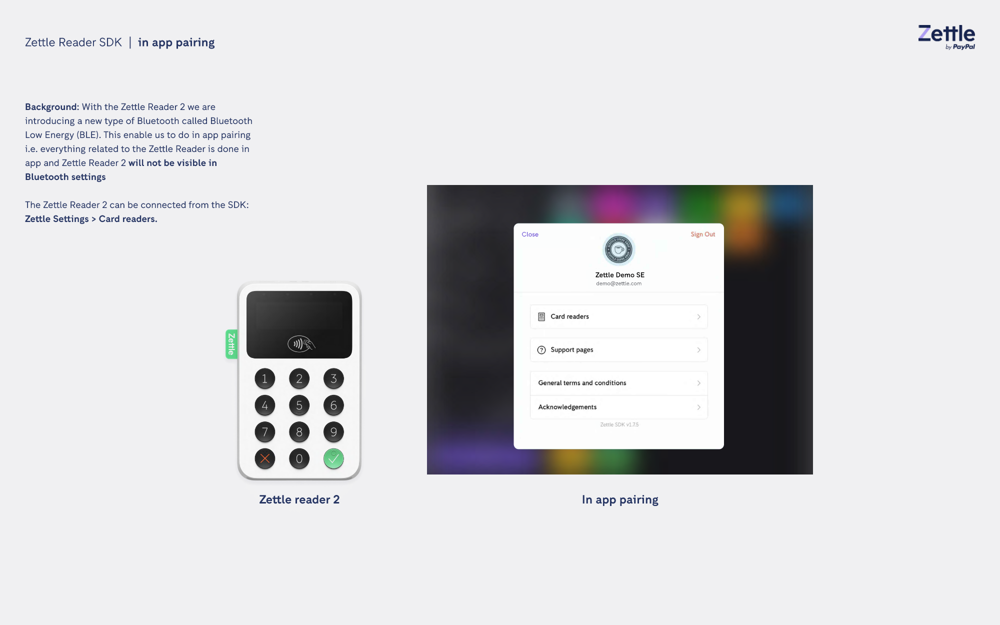
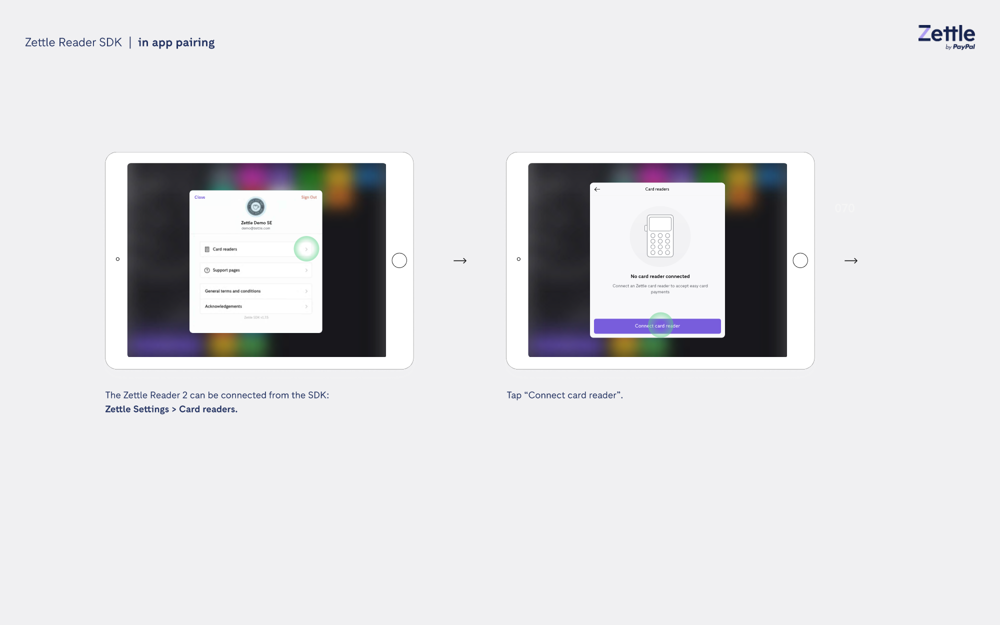
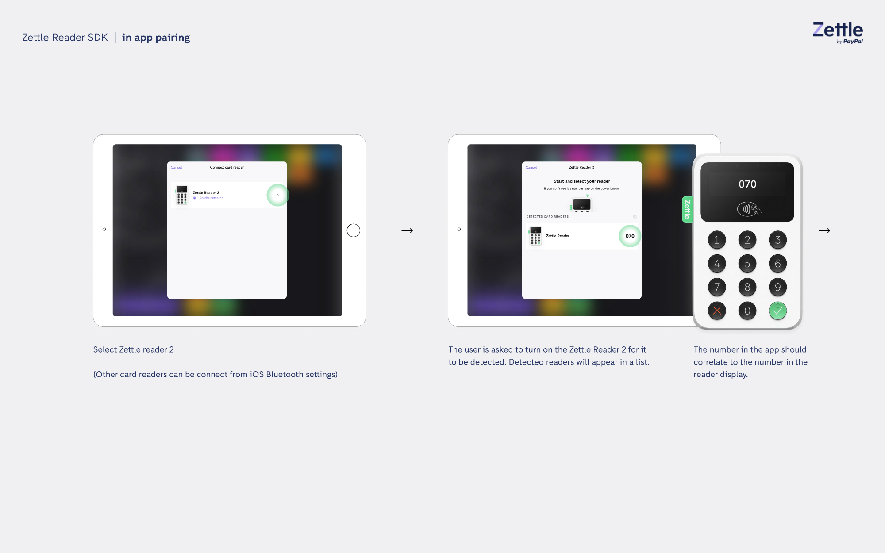
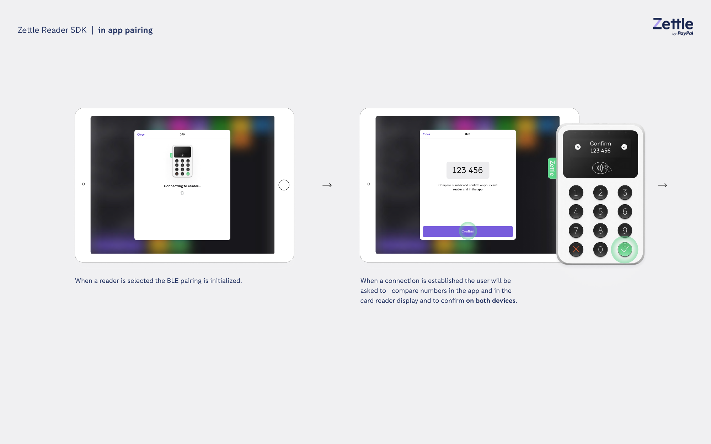
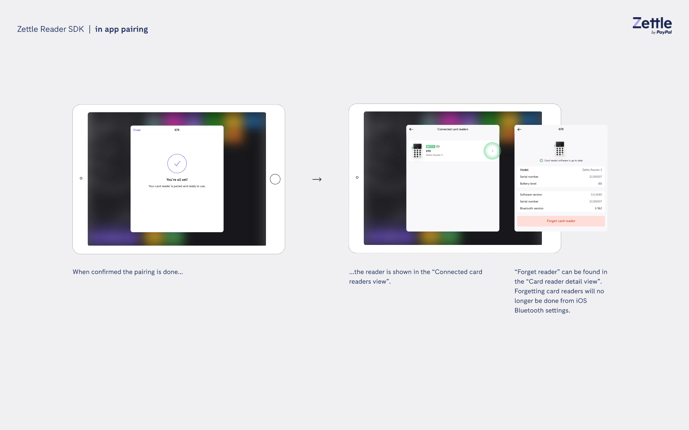

# In-app pairing guide
## Background
With the Zettle Reader 2 we are introducing a new type of Bluetooth called Bluetooth Low Energey (BLE). This enables us to do in-app pairing. This means that everything related to the Zettle reader is done in the application. The Zettle Reader 2 will not be visible in Bluetooth settings. 
1. Go to **Zettle Settings** and select **Card readers** to connect the Zettle Reader 2 from the SDK. 
 
2. The message “No card reader connected” displays.
3. Tap **Connect card reader**. 
 
4. Select **Zettle Reader 2**. Note that other card readers can be connected from the iOS Bluetooth settings.
5. The user is asked to turn on the Zettle Reader 2 for it to be detected. Detected readers appear in the list.
6. The number displayed in the app should correlate to the number in the card reader display. 
 
7. When a card reader is selected, the BLE pairing is initialized. 
8. When a connection is established, the user will be asked to compare numbers in the app and in the card reader display.
9. The user must confirm the numbers on both devices. This is done by selecting **Confirm** in the app, and clicking the confirmation button in the card reader. 
 
10. When the pairing is confirmed, the reader displays in the **Connected card readers** view.
11. To forget a card reader, go to the Card reader detail view. Note that forgetting a card reader can no longer be done from the iOS Bluetooth settings. 
 
